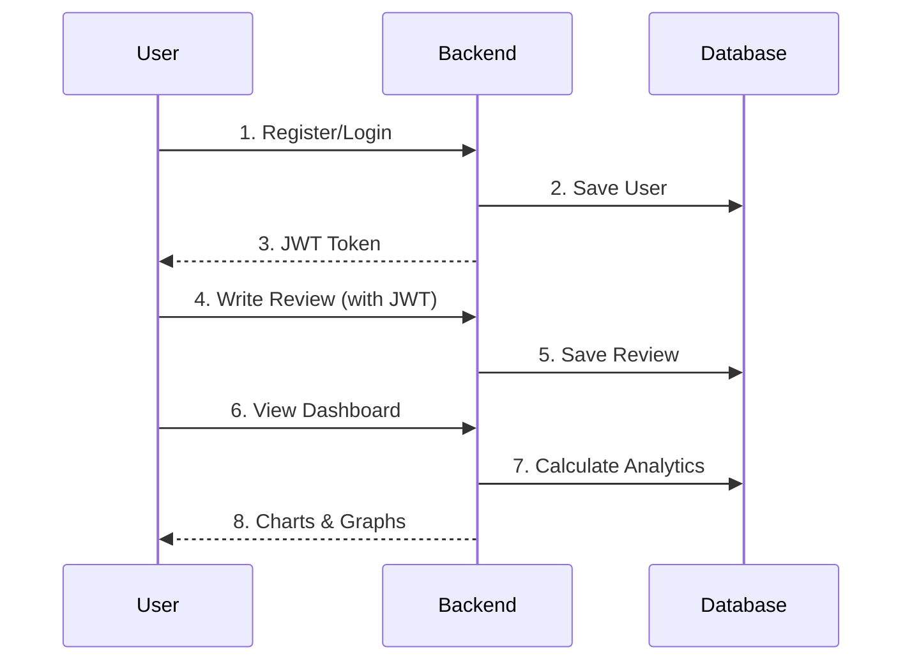

# Meta Glasses Reviews API &amp; Analytics Dashboard

A full-stack review analytics and management system built with Node.js, Express.js, MongoDB, React, Redux Toolkit, Tailwind CSS, and Material UI.

## Overview

This project is based on a real-world Meta Glasses Reviews dataset and is designed to handle large-scale review data with secure authentication, advanced filtering, search, sorting, pagination, aggregation, and dashboard analytics.

It includes a production-style backend architecture with MVC structure, middleware chaining, role-based access control, and RESTful API design.

## Architecture Flow



## Key Features

- Complete CRUD APIs for review data
- JWT-based authentication and protected routes
- Admin and user dashboard support
- Advanced filtering, search, sorting, and pagination
- MongoDB aggregation pipelines for analytics
- Request validation and centralized error handling
- API rate limiting and secure middleware flow
- Role-based access control (RBAC)
- Real-world dataset modeling and seeding support

## Tech Stack

### Backend
- **Node.js** - Runtime environment
- **Express.js** - Web framework
- **MongoDB** - NoSQL database
- **Mongoose** - MongoDB ODM
- **JWT** - Authentication tokens
- **bcryptjs** - Password hashing
- **dotenv** - Environment variables
- **cors** - Cross-origin resource sharing
- **morgan** - HTTP logging
- **helmet** - Security headers
- **compression** - Response compression
- **express-rate-limit** - Rate limiting
- **express-validator** - Request validation

### Frontend
- **React.js 19** - UI library
- **Vite** - Build tool
- **Redux Toolkit** - State management
- **Tailwind CSS** - Utility-first CSS
- **Material UI** - Component library
- **Axios** - HTTP client
- **React Router DOM** - Routing
- **Formik** - Form management
- **Yup** - Validation
- **React Helmet Async** - Document head manager
- **Recharts** - Charts/Graphs

## Project Structure

```
meta-glasses-api/
├── backend/
│   ├── src/
│   │   ├── config/
│   │   │   └── db.js              # MongoDB connection
│   │   ├── models/
│   │   │   ├── User.js            # User model
│   │   │   └── Review.js          # Review model
│   │   ├── controllers/
│   │   │   ├── authController.js  # Auth logic
│   │   │   └── reviewController.js # Review logic
│   │   ├── routes/
│   │   │   ├── authRoutes.js      # Auth endpoints
│   │   │   └── reviewRoutes.js    # Review endpoints
│   │   ├── middleware/
│   │   │   ├── authMiddleware.js  # JWT protection
│   │   │   ├── errorMiddleware.js # Error handling
│   │   │   └── validate.js        # Request validation
│   │   ├── utils/
│   │   │   └── sendToken.js       # JWT cookie helper
│   │   ├── app.js                 # Express app setup
│   │   └── server.js              # Server entry point
│   ├── package.json
│   ├── package-lock.json
│   ├── .env                       # Environment variables
│   ├── .env.example               # Env template
│   ├── .gitignore
│   └── nodemon.json
├── frontend/
│   ├── src/
│   │   ├── components/            # Reusable components
│   │   ├── pages/                 # Page components
│   │   ├── features/              # Redux slices
│   │   ├── services/              # API services
│   │   ├── utils/                 # Utility functions
│   │   ├── assets/
│   │   ├── App.jsx
│   │   ├── main.jsx
│   │   └── index.css
│   ├── public/
│   ├── package.json
│   ├── vite.config.js
│   ├── tailwind.config.js
│   └── eslint.config.js
└── README.md
```

## Database Schema

### User Collection
```javascript
{
  _id: ObjectId,
  name: String (required),
  email: String (required, unique),
  password: String (required, min 6 chars, hashed),
  role: String (enum: ['user', 'admin'], default: 'user'),
  createdAt: Date (default: Date.now)
}
```

### Review Collection
```javascript
{
  _id: ObjectId,
  productName: String (required),
  reviewTitle: String (required),
  reviewText: String (required),
  rating: Number (min: 1, max: 5, required),
  author: ObjectId (ref: 'User', required),
  helpfulCount: Number (default: 0),
  verifiedPurchase: Boolean (default: false),
  tags: [String],
  createdAt: Date (default: Date.now),
  updatedAt: Date (default: Date.now)
}
```

**Indexes:**
- `{ rating: 1, createdAt: -1 }` - For sorting reviews
- `{ productName: 'text', reviewTitle: 'text', reviewText: 'text' }` - For full-text search

## API Documentation

### Authentication Endpoints

#### Register User
```http
POST /api/v1/auth/register
Content-Type: application/json

{
  "name": "John Doe",
  "email": "john@example.com",
  "password": "password123"
}
```

#### Login User
```http
POST /api/v1/auth/login
Content-Type: application/json

{
  "email": "john@example.com",
  "password": "password123"
}
```

### Review Endpoints

#### Get All Reviews (With Filters, Search, Pagination)
```http
GET /api/v1/reviews?page=1&amp;limit=10&amp;rating=5&amp;search=meta
Authorization: Bearer &lt;token&gt;
```

#### Create Review
```http
POST /api/v1/reviews
Content-Type: application/json
Authorization: Bearer &lt;token&gt;

{
  "productName": "Meta Quest 3",
  "reviewTitle": "Best VR Headset!",
  "reviewText": "Amazing experience with the new Meta Quest 3...",
  "rating": 5,
  "tags": ["vr", "meta", "quest"]
}
```

#### Get Analytics
```http
GET /api/v1/reviews/analytics
Authorization: Bearer &lt;token&gt;
```

## Getting Started

### Prerequisites
- Node.js (v18 or higher)
- MongoDB (local or cloud)
- npm or yarn

### Backend Setup

1. Navigate to backend directory
```bash
cd backend
```

2. Install dependencies
```bash
npm install
```

3. Configure environment variables
```bash
# Copy .env.example to .env and update values
cp .env.example .env
```

4. Update `.env` file:
```env
NODE_ENV=development
PORT=5000
MONGO_URI=mongodb://localhost:27017/meta-glasses
JWT_SECRET=your_jwt_secret_key_here_change_in_production
JWT_EXPIRES_IN=7d
```

5. Start development server
```bash
npm run dev
```

### Frontend Setup

1. Navigate to frontend directory
```bash
cd frontend
```

2. Install dependencies
```bash
npm install
```

3. Create `.env` file:
```env
VITE_API_URL=http://localhost:5000/api/v1
```

4. Start development server
```bash
npm run dev
```

## Environment Variables

### Backend (.env)
| Variable | Description | Default |
|----------|-------------|---------|
| NODE_ENV | Environment mode | development |
| PORT | Server port | 5000 |
| MONGO_URI | MongoDB connection string | - |
| JWT_SECRET | JWT secret key | - |
| JWT_EXPIRES_IN | JWT expiration | 7d |

### Frontend (.env)
| Variable | Description | Default |
|----------|-------------|---------|
| VITE_API_URL | Backend API URL | http://localhost:5000/api/v1 |

## Testing

Backend APIs can be tested using:
- Postman
- Thunder Client (VS Code extension)
- curl

## Security Features

- Password hashing with bcryptjs
- JWT token authentication
- HTTP-only cookies
- Helmet security headers
- CORS configuration
- Rate limiting
- Input validation
- Protected routes with role-based access

## Author

Het Sakariya

## License

This project is for educational and portfolio purposes.
